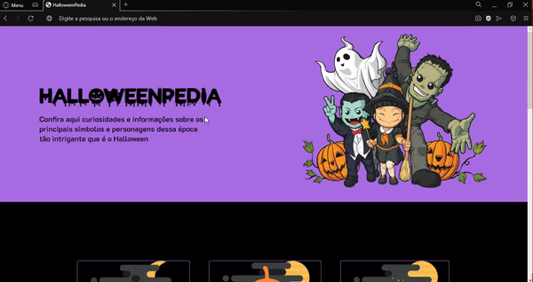

  Objetivo dos desafios é ajudá-lo a melhorar suas habilidades fazendo mini projetos semanais.

  <a href="https://discord.com/invite/QevDJqCzaY">Entre na nossa comunidade!</a>

---

<h1 align="center">
  OnePage
</h1>

  <a href="#desafio-03---onepage-">Demonstração</a>&nbsp;&nbsp;&nbsp;|&nbsp;&nbsp;&nbsp;
  <a href="#rocket-tecnologias">Tecnologias</a>&nbsp;&nbsp;&nbsp;|&nbsp;&nbsp;&nbsp;
    <a href="#-features">Features</a>&nbsp;&nbsp;&nbsp;|&nbsp;&nbsp;&nbsp;
  <a href="#-licença">Licença</a>

---

## 🎯 Índice de desafios

* [Desafio 01 - Blog](https://github.com/Mateuss18/Desafio01_Codelandia-Blog)
* [Desafio 02 - JordanShoes](https://github.com/Mateuss18/Desafio02_Codelandia-JordanShoes)
* [Desafio 03 - HallowenPedia](https://github.com/Mateuss18/Desafio03_Codelandia-HalloweenPedia)
* [Desafio 04 - Login Page](https://github.com/Mateuss18/Desafio04_Login-Page)
---

### **Desafio 03 - OnePage** 

### [🔛 Rodar pagina](https://mateuss18.github.io/Desafio03_Codelandia-HalloweenPedia/)

Link do desafio no Figma: [Clique aqui](https://www.figma.com/file/Yb9IBH56g7T1hdIyZ3BMNO/Desafios---Codel%C3%A2ndia?node-id=3743%3A36)

>
---
## :rocket: Tecnologias

---
## 💡 Features

- Scroll reveal
- Responsivo
- Validação formulario

>
---
## 📝 Licença

Esse projeto está sob a licença MIT. Veja o arquivo [LICENSE](LICENSE) para mais detalhes.

---

Feito por Mateus Lopes :D   

